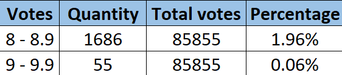
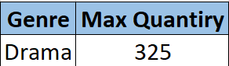
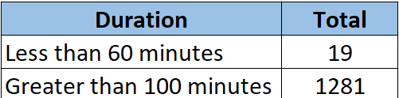

# GROUP_PROJECT

- [Topic](#topic)
- [Reason for the topic](#reason-for-the-topic)
- [Data used](#data-used)
- [Purpose of Project](#purpose-of-project)

## Topic: *PREDICTING IMDb RATINGS*

## Reason for the topic

- **IMDb**, whose full English name is **Internet Movie Database**, is a web-based data set identified with films, TV shows, home recordings, games... Also, streaming internet-based substance, including full team: entertainers, creation group. What's more, IMDb gives a wide scope of film-related data, be it individual memoirs, plot synopses, tests, or client audits. From that point, you can likewise effectively see the sorts of rankings dependent on a wide range of rules, so new clients can undoubtedly see the issues and content that get the most client consideration.

- We chose this topic because it makes it easy for people to find good movies. Besides, with the current situation, the Covid-19 makes people still afraid to watch movies in cinemas, people often choose the movies to watch at home. Therefore, IMDb makes it easy for people to pick out which movies they love, with high ratings, or their favorite actors.
IMDb Movie Review Prediction

The purpose is to find the best Machine learning Algorithms that can predict the imdb rating based on the features given in these four tables. To achieve this from Various Models the model with the lowest root mean squared error, best accuracy, and best confusion matrix is selected.

IMDb Movie dataset tables:
IMDb Movies.csv

IMDb Ratings.csv

Machine Learning Models: Linear Regression, Logistic Regression, Random Forest,  SVM, K-means Algorithm

Target: IMDb Total Average Weighted Rating
Output: IMDb Rating

Feature: Imdb_title_id, title, year, date_published, genre, duration, country, language, director, writer, reviews
Categorical Feature: title, year, genre, country, language, direction, reviews
Quantitative Feature: Date, Duration, vote, budget, gross income, total votes, us_voters rating, 

# Results: Accuracy, Confusion Matrix

# Summary of Significant Steps
Join the four tables to create a single table, analyze the datasets
Data Cleaning, and dropping unwanted rows and columns
Find the relationship between the feature and the target, find the importance of each feature, drop the columns according to the importance ranking
Data splitting into training and testing sets
Train and Fit the Machine Learning Model using the processed and cleaned data
Calculated the balanced accuracy score along with the confusion matrix
Compare accuracy in different models ; SVM, Random Forest and Neural Networks
Add results to database such as Postgres pgAdmin
Reports outcomes in Tableau for Visualization.
Final Summary

**Percentage of voting**

**Highest genre of votes from 8 to 10**

**Comparing the duration from 8 to 10**

## Data used
We collected all movie data from [here](https://www.kaggle.com/stefanoleone992/imdb-extensive-dataset?select=IMDb+ratings.csv)

IMDb Movie Review Prediction

The purpose is to find the best Machine learning Algorithms that can predict the imdb rating based on the features given in these four tables. To achieve this from Various Models the model with the lowest root mean squared error, best accuracy, and best confusion matrix is selected.

IMDb Movie dataset tables:
IMDb Movies.csv

IMDb Ratings.csv

Tables Used: Imdb_ratings.csv, IMDB_movie.csv

Inputs, X:   genre, duration, country, language, weighted_average_rating, tot_voters_below_30, tot_voters_below_18, tot_voters_above_45, tot_voters_below_45, tot_male_voters, tot_female_voters

Output, Y:  Average Weighted Rating

## Machine Learning Models:

#### Description of Preliminary Data Processsing

-  The very first steps include importing the libraries and importing the datasets which are IMDB_movies.csv a total of 22 columns and IMDB_ratings.csv a total of 49 columns
-  The IMDB_movies.csv contained the features titel, year, genre, duration, country, language, director, actor, writer, description, average vote, budget, review from users, review from critics

#### Description of preliminary feature engineering and selection
- Identify the dependent and the independent variable. After looking through the dataset the features removed were USA gross income, World gross income, metascore due to the null data. Other features were removed due to low correlation to the dependent variable "weighed average rating". The independent variable are as follows [genre, duration, country, language, weighted_average_rating, tot_voters_below_30, tot_voters_below_18, tot_voters_above_45, tot_voters_below_45, tot_male_voters, tot_female_voters]
- The dataset where the cleaned by addressing the null values and dropping hte null rows
- After the cleaning process the categorical data like genre, country and language carrying multiple values were addressed using binary encoding with help of excel sheets

### 1. Multiple Linear Regression
Linear Regression is a very simple algorithm that can be implemented very easily to give satisfactory results.Furthermore, these models can be trained easily and efficiently even on systems with relatively low computational power when compared to other complex algorithms. Linear regression has a considerably lower time complexity when compared to some of the other machine learning algorithms.The mathematical equations of Linear regression are also fairly easy to understand and interpret

#### Benefits
Models can be trained easily and efficiently even on systems with relatively low computational power when compared to other complex algorithms
Linear regression fits linearly separable datasets almost perfectly and is often used to find the nature of the relationship between variables
Overfitting is a situation that arises when a machine learning model fits a dataset very closely and hence captures the noisy data as well

#### Limitations
A situation that arises when a machine learning model fails to capture the data properly.This typically occurs when the hypothesis function cannot fit the data well.
Outliers of a data set are anomalies or extreme values that deviate from the other data points of the distribution.Data outliers can damage the performance
Outliers can have a very big impact on linear regression's performance and hence they must be dealt with appropriately before linear regression is applied on the dataset.

### 2. SVM
Since SVM is a binary classifier, we had to split the target in our data into two classications: Ratings above 7 and Ratings below 7.

#### Benefits

#### Limitations
The dataset we used for this project is quite massive which is why training the dataset for this machine learning model took immense amount of time. One way we dealt with this issue is by selecting a random sample from the dataset and training it for the model. 
Another limitation is that this model can only classify data in to two groups. So, instead of predicting the average rating of the movie, this model can only predict a certain window the rating can lie in.

### 3. Random Forest Regression

 Random Forest Regression is a supervised learning algorithm that uses ensemble learning method for regression. Ensemble learning method is a technique that combines predictions from multiple machine learning algorithms to make a more accurate prediction than a single model. A random forest regressor works with data having a numeric or continuous output and they cannot be defined by classes.
 ##### Random Forest algorithm
 - Pick at random k data points from the training set.
- Build a decision tree associated to these k data points.
- Choose the number N of trees you want to build and repeat steps 1 and 2.
- For a new data point, make each one of your N-tree trees predict the value of y for the data point in question and assign the new data point to the average across all of the predicted y values.
 

#### Description of how data was split into
- Dependent and Independent variables were assigned to X(features except weighted average rating) and Y (weighted average rating) variablesrespectively

- Split the dataset into the Training set and Test set. The training set contains known output from which the model learns, test set then tests the model’s predictions based on what it learned from the training set, with the random state=78.
- Fitting the Standard Scaler with the training data. Scaling the data.
- Create a random forest regressor, did model fitting with n_estimator from 50 to 800 with the random state being 1

#### Results
Scores for each for the models were as follows:  [0.49415757514316994,0.4947008957127814,0.4958920277984976,0.4960607807872609,0.4961116558077189,0.4958916103852188]

Maximum Score: 0.496

### 4. Gradient Boosting
Boosting is a technique to combine a set of weak learners into a strong learner. Boosting trains a sequence of weak models.The model is trained then evaluated. After evaluating the errors of the first model, another model is trained. This time, however, the model gives extra weight to the errors from the previous model. The purpose of this weighting is to minimize similar errors in subsequent models. Then, the errors from the second model are given extra weight for the third model.

#### Benefits
One of the many advantages of the AdaBoost Algorithm is it is fast, simple and easy to program. Also, it has the flexibility to be combined with any machine learning algorithm, and there is no need to tune the parameters except for T. It has been extended to learning problems beyond binary classification, and it is versatile as it can be used with text or numeric data.

#### Limitations
Gradient boosting also has few disadvantages, such as it is from empirical evidence and particularly vulnerable to uniform noise. Weak classifiers being too weak can lead to low margins and overfitting.

### 5. Deep Learning
Deep learning is a subset of ML, which is essentially a neural network with three or more layers. These neural networks attempt to simulate the behavior of the human brain—albeit far from matching its ability—allowing it to “learn” from large amounts of data. While a neural network with a single layer can still make approximate predictions, additional hidden layers can help to optimize and refine for accuracy.

#### Benefits
Features are automatically deduced and optimally tuned for desired outcome. 
Features are not required to be extracted ahead of time. This avoids time consuming machine learning techniques.
Robustness to natural variations in the data is automatically learned.
The same neural network based approach can be applied to many different applications and data types.

#### Limitations
It requires very large amount of data in order to perform better than other techniques.
It is extremely expensive to train due to complex data models.
There is no standard theory to guide you in selecting right deep learning tools as it requires knowledge of topology, training method and other parameters

**Results**
##### Metrics Used to Evaluate

Classification Models : Accuracy

Regression Models : Mean Square Error, Score

- **Multiple linear Regression** :  
- **Support Vector Machine**
- **Random Forest Regression**   Best Score : 0.4961116558077189
- **Gradient Boosting**  Accuracy : 0.40275730924649394
- **Deep Learning**

# AWS Database Links

AWS link for the IMDb datasets
1. IMDb_ratings.csv [ Link ](https://imdbdatasetuoft.s3.us-east-2.amazonaws.com/IMDb+ratings.csv) 
2. IMDb_movies.csv [Link](https://imdbdatasetuoft.s3.us-east-2.amazonaws.com/IMDb+movies.csv)
3. Encoded_data.csv [Link](https://imdbdatasetuoft.s3.us-east-2.amazonaws.com/Encoded_Data.csv)
4. IMDb_data.csv [Link](https://imdbdatasetuoft.s3.us-east-2.amazonaws.com/IMDb_data.csv)
5. IMDB_lang.csv [here](https://imdb-ratings-project-2021.s3.us-east-2.amazonaws.com/IMDb_Lang.csv)
6. IMDB_ratings.csv [here](https://imdb-ratings-project-2021.s3.us-east-2.amazonaws.com/IMDb_ratings.csv)

# Dashboard Links

- [Tableau link](https://public.tableau.com/app/profile/syed.bari/viz/CapstoneSegment1_16362709165670/Dashboard1?publish=yes)
- [Tableau link (Language vs Weighted Av. rating)](https://public.tableau.com/app/profile/wardah.anis/viz/languagevsaveragerating/Sheet1?publish=yes)
- [Tableau link (Country vs Weighted Av. rating)](https://public.tableau.com/app/profile/wardah.anis/viz/CountryvsAverageRating/Sheet1?publish=yes)
- Tableau [here](https://public.tableau.com/app/profile/adegbenga.olusoji.ayoola/viz/GROUPPROJECT_16362489603570/AverageVotebyCountry?publish=yes)
- Tableau [here](https://public.tableau.com/app/profile/adegbenga.olusoji.ayoola/viz/GROUPPROJECT_16362489603570/Sheet1?publish=yes)

# Summary of Significant Steps
Join the four tables to create a single table, analyze the datasets

- Data Cleaning, and dropping unwanted rows and columns

- Find the relationship between the feature and the target, find the importance of each feature, drop the columns according to the importance ranking

- Data splitting into training and testing sets

- Train and Fit the Machine Learning Model using the processed and cleaned data

- Calculated the balanced accuracy score along with the confusion matrix

- Compare accuracy in different models ; SVM, Random Forest and Neural Networks

- Add results to database such as Postgres pgAdmin

- Reports outcomes in Tableau for Visualization.

- Final Summary

